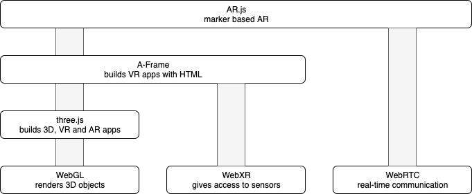
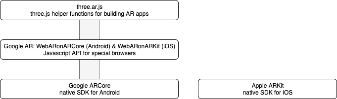

# Cultural Heritage

## Motivation

**Reality** mixed with **Concepts** from mind which are represented as words, images and videos.

## AR.js 

AR.js is by [Jerome Etienne](https://github.com/jeromeetienne/AR.js), which provides both an A-Frame and a three.js extension that allows building marker-based AR scenes. AR.js is built with WebGL and WebRTC, based on which it is able to work on almost every browser on every device, e.g., desktops and mobiles, regardless of specific operating systems. This is a pure web-based solution and its architecture is as below:

The source code is in this [link](./ar-js/)

To set up the local runnning environment, a local HTTPS server is required.

## Three.ar.js

Google AR provides WebARonARCore (Android) and WebARonARKit (iOS) for developers to build an experimental app to create AR experiences based on web technologies. Instead of using already-installed browsers, the app need to be prebuilt and pushed to the device. Its architecture is as below: 

The source code is in this [link](./three-ar-js/)

To set up the local running environment:
* iOS: https://github.com/google-ar/WebARonARKit
* Android: https://github.com/google-ar/WebARonARCore

## Reference
* https://cris.brighton.ac.uk/ws/portalfiles/portal/7253800/placebased_lowres.pdf
* http://www.sbs.com.au/theboat/
* http://www.ro.me/
* https://github.com/google-ar/WebARonARKit
* https://github.com/google-ar/three.ar.js
* https://github.com/mrdoob/three.js
* https://github.com/jeromeetienne/AR.js