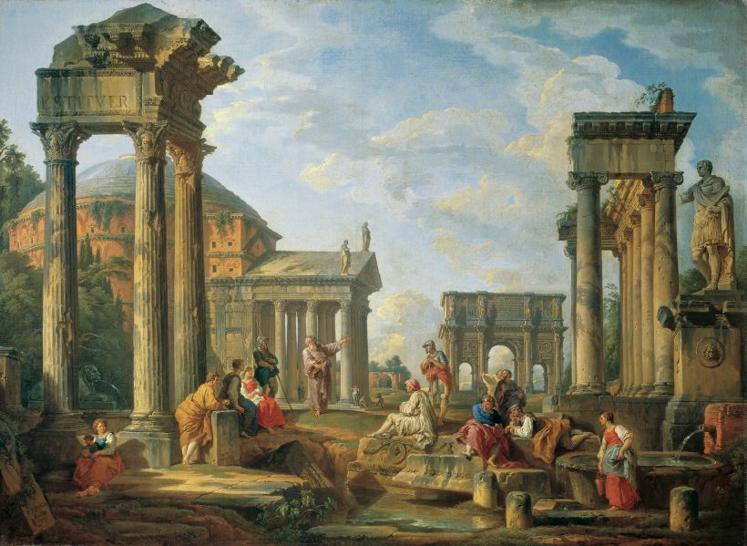

# Cultural Heritage

## Motivation

**Reality** mixed with **Concepts** from mind which are represented as images, music and words.

## To-Do List

- [] Avatar put into camera.

##  Vision

	

## Reference
* https://cris.brighton.ac.uk/ws/portalfiles/portal/7253800/placebased_lowres.pdf
* http://www.sbs.com.au/theboat/
* http://www.ro.me/